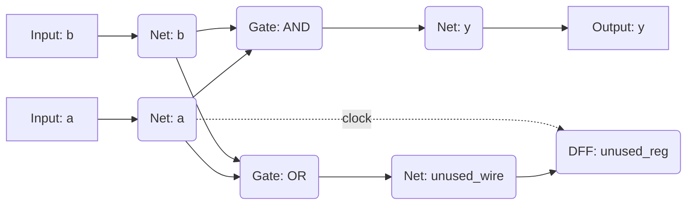
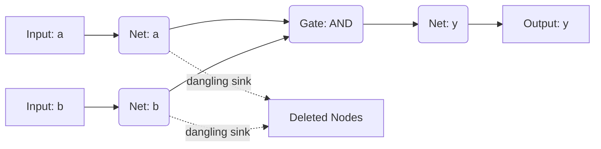
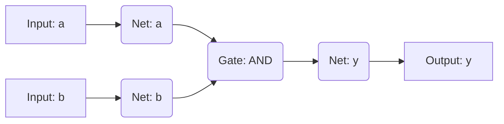

# Optimisation Process

This document provides a short overview of the algorithms / processes used for the logic optimisation phase in the `openxc2064` tool chain. 

After the HDL is synthesised into a generic Netlist (a representation of the computational graph), it often contains redundancies and unreachable / unused logic. Eliminating these saves valuable space on the FPGA, and can reduce propagation delay in a design.

In the [`Optimiser`](/src/openxc2064/synthesis/optimiser.py) class, three simplification techniques are implemented; **Dead Code Elimination(DCE)**, **Constant Folding**, and **Structural Boolean Simplification**.


The `Optimiser` class iteratively applies all three of these reduction techniques repeatedly, until no more changes are made in a single pass, which marks the point where the Netlist is in its simplest form*.

\* By 'simplest', we mean simplest form that can be achieved by using the simplification techniques implemented. The reduction techniques currently used here are not guaranteed to produce an optimally minimal netlist.

---


## 1. Dead Code Elimination

In the context of hardware, "Dead Code" refers to any logic gate, register or net that does not eventually drive an output. This can easily happen if a user defines a multi-bit register, but only actively reads from a subset of its bits.

### The algorithm

DCE operates on the computational graph (the `Netlist`), treating it as a Directed Acyclic Graph (DAG). It follows the steps below:

1. **Live Set**: Initialise a set of "Live" nodes.

2. **Port collection**: Examine every top-level output port of the netlist. THe nodes that directly drive these output ports are inherrently useful, so we add them to the "live" set. Input ports are also unconditionally added.

3. **Netlist traversal**: For every node that gets added to the "live" set, inspect its drivers. Any node that drives a node in the live set must also be added to the "live" set. This process is effectively a BFS of the computational graph.

4. **Node pruning**: Once the traversal finished, we have the transitive closure of all nodes that are necessary to compute the module's outputs. Any node that is **not** in the "live" set is removed, as it is not necessary to compute the module's outputs.

5. **Netlist reconstruction**: After removing the dead nodes, we need to clean up the connecting wires (`Net`s). A net is considered "live" if it belongs to any remaining live node or is an input/output port. We collect all live nets and rebuild the netlist's internal net registry.

### Visualising DCE

To visualise the DCE process, we can use the following example. Suppose we start with the HDL below:

```verilog
module example(input a, input b, output y);
    wire unused_wire;
    wire unused_reg;
    
    // The live pathway
    assign y = a & b;
    
    // The dead pathway (never read by any outputs)
    assign unused_wire = a | b;
    
    always @(posedge a) begin
        unused_reg <= unused_wire;
    end
endmodule
```

**Circuit Before DCE:**

Notice how the `OR` gate and the `DFF` are structurally valid, but they ultimately do not cascade into the module output `y`.



**After the Sweep (Nodes removed)**

After the pass, we identify that only `Gate: AND`, `Input: a`, and `Input: b` are required. The unvisited `OR` Gate and `DFF` are completely deleted from the node registry. However, the live nets (`Net: a` and `Net: b`) temporarily retain dangling `sink` references to the ghosts of these deleted nodes.



** Netlist reconstruction**

In the final step, we rebuild the netlist by removing the dangling sinks and reassigning the drivers of each node to their new locations. The live nets iterate through their `sink` lists and sever any invalid connections to dead components, leaving a minimised graph.



---

## 2. Constant Folding

"Constant Folding" is the process of resolving logic at synthesis-time rather than allowing it to be computed in the circuit of the final design. If a gate's inputs are driven by stationary values (0 or 1), we can often determine the output immediately.

We can apply a series of Boolean algebra identities to optimise, or "fold" these constants.

### Boolean identities for Basic Gates

When evaluating generic nodes (`AND`, `OR`, `XOR`, and `NOT`), we can use the identities laid out below:

#### AND Gates:
* **Annihilation**: `A AND 0 = 0` (If *any* input is 0, the output is guaranteed to be 0). In this case, the entire AND gate can be removed and replaced with a constant `0`.
* **Identity**: `A AND 1 = A` (A 1 input has no restrictive effect, so the output perfectly mirrors the other input `A`). In this case, the entire AND gate can be removed and replaced with the input `A`.

#### OR Gates:
* **Annihilation**: `A OR 1 = 1` (If *any* input is 1, the output is guaranteed to be 1). In this case, the entire OR gate can be removed and replaced with a constant `1`.
* **Identity**: `A OR 0 = A` (A 0 input has no restrictive effect, so the output perfectly mirrors the other input `A`). In this case, the entire OR gate can be removed and replaced with the input `A`.

#### XOR Gates:
* **Identity**: `A XOR 0 = A` (If `A` differs from 0, the output must be 1. If `A` doesn't differ from 0, the output must be 0. Thus, we mirror `A`). In this case, the entire XOR gate can be removed and replaced with the input `A`.
* **Inversion**: `A XOR 1 = NOT A` (If `A` differs from 1, the output must be 0. If `A` doesn't differ from 1, the output must be 1. This acts as an inverter). In this case, the entire XOR gate can be removed and replaced with the input `NOT A`.

#### NOT Gates:
* **Identity**: `NOT NOT A = A` (A double negation cancels out, so the output perfectly mirrors the other input `A`). In this case, the entire NOT gate can be removed and replaced with the input `A`.

### MUX Optimization (Multiplexers)

A `MUX` serves as a switch. Given a selection input `S`, it routes either the `True` path or the `False` path. Its boolean equation is: `Q = (S AND True) OR (NOT S AND False)`.

We can apply these reductions to a MUX:
* **Constant Selection**: 
    If `S = 1`, the MUX simply routes the `True` path. The MUX is replaced by a simple wire (buffer) connected to the `True` source.
    If `S = 0`, the MUX routes the `False` path.
* **Boolean Coercion**:
    If the `True` path is a constant `1` and the `False` path is a constant `0`, then `Q = (S AND 1) OR (NOT S AND 0) = S`. The MUX can be replaced completely by a buffer of its own selection signal.
    Conversely, if `True=0` and `False=1`, the MUX acts as an Inverter (`NOT S`), so can be replaced by a `NOT` gate.

---


## 3. Structural Boolean Simplification

While Constant Folding eliminates logic driven by static values (`1` or `0`), we can also simplify logic driven by dynamic variables (nets) by comparing the *structure* of their inputs. The `_simplify_logic` method acts as a very simple algebraic reducer for these combinatorial patterns.

### Identity Laws
Sometimes, due to previous optimisations or poorly written user HDL, a logic gate might receive the exact same net on multiple inputs. We can take advantage of this to simplify the logic:
* `A AND A = A`
* `A OR A = A`
* `MUX(S, A, A) = A`: If a MUX chooses between `A` and `A`, the selector doesn't matter; the output is always `A`. If these patterns are detected, the gate is simply replaced by a buffer passing `A` through.
* `A XOR A = 0`: Since the inputs are identical, they never differ. This replaces the gate with a `Constant(0)`.

### Inverse Laws
By checking if one input is driven by a `NOT` gate that originates from the other input, we can identify inversely related signals (e.g., `A` and `NOT A`).
*   `A AND (NOT A) = 0`: They can never both be true.
*   `A OR (NOT A) = 1`: One of them must be true.
*   `A XOR (NOT A) = 1`: They are guaranteed to differ.

### Double Inversion
If a `NOT` gate is fed by another `NOT` gate, they cancel each other out.
*   `NOT (NOT A) = A`
The second `NOT` gate is replaced by a straightforward buffer passing `A`.

