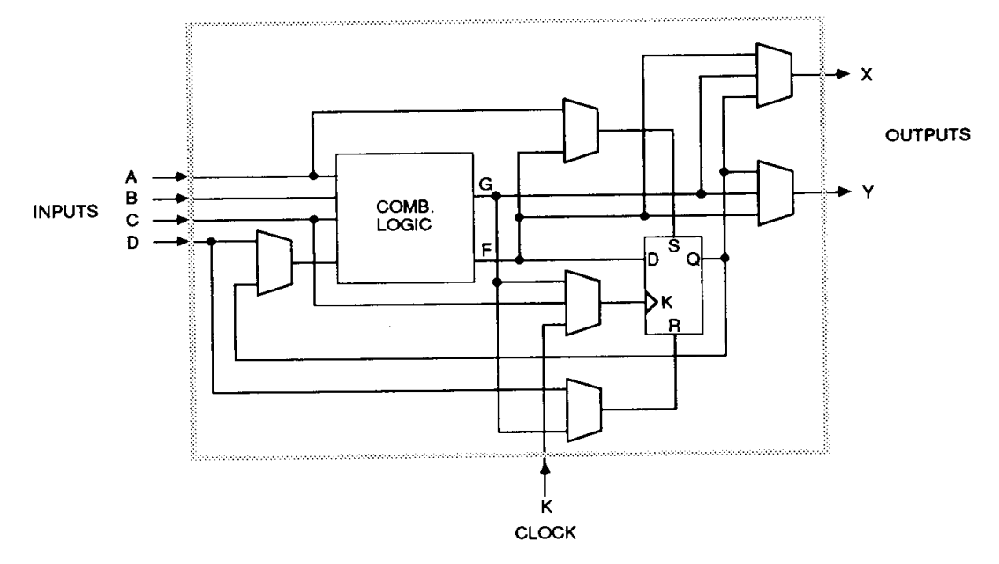
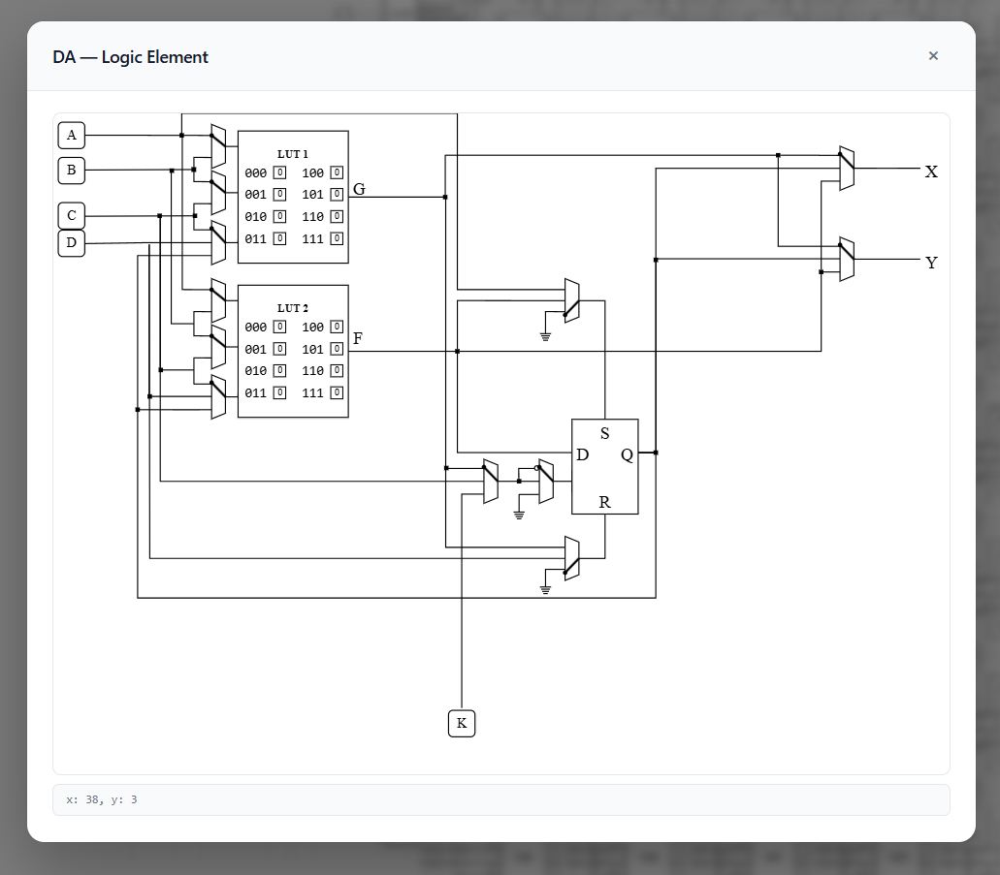

# XC2064 Primatives Breakdown
## Previous Works (disclaimer)
## Configurable Logic Blocks (CLBs)
At its core, all logic within the XC2064 chip (all FPGAs really) is built arount their `Configurable Logic Blocks (CLBS)`. These blocks use look-up tables (LUTs) thrown together with a few other logic primitives to enable the emulation of simple logic functions. These CLBs are then stitched together with a complex overarching fabric of re-routable nets to then synthesise more complex higher order logic functions.

In modern FPGAs, the CLBs contain a few LUTs (typically with 3 - 6 inputs), a small arithmetic module (usually just addition), and an array of D-Flip-Flops (DFFs). However, in the XC2064, the CLBs contain two LUT-3s (3 input LUTs), and a single DFF. There is then a series of 2, or 3 inputs multiplexers (MUXs) which can be configured to route the nets within the CLB to create which ever arbitrary function the block is intended for.

The two LUTs can be configured in one of 3 ways to create either:
- (1) one 4 input logic function
- (2) two 3 input logic functions with distinct outputs, or
- (3) two 3 input functions where both `F` and `G` are tied together, and the `B` input selects which of the LUTs control the outputs.

For simplicity, the OpenXC2064 LCA simulator forces the CLB to use option (2), where the two LUTs are completely separate, and the outputs are can be individually controlled. The Figure below shows the CLB design implemented in the simulator. Each multiplexer can be clicked to toggle which of the inputs are routed to the outputs, and the LUT outputs can be individually set based on the input combinations.

The CLBs on the XC2064 have 5 input pins, and 2 output pins. The inputs `A`, `B`, `C` and `D` are used mainly as standard logic inputs that control the LUTs, but `A`, `C`, and `D` can be re-routed to control parts of the DFF instead of required. The input `K` can only be used as a clock input to the DFF, externally to the CLBs, each `K` input is directly wired to the XC2064 singular global clock line. Finally, the outputs `X` and `Y` can each be driven through either the LUT-3 outputs, or the DFF output.

## Programming Interconnect Pins (PIPs)
## "Magic" Switching Matrices
## IO Banks
## XACT

# Simulation Breakdown
## Core Functionality / Behaviour 
### Net Addressing
### Simulation Configuration File (`config.ts`)
### CLBs
### IO Banks
## Import / Export LCA Configurations

